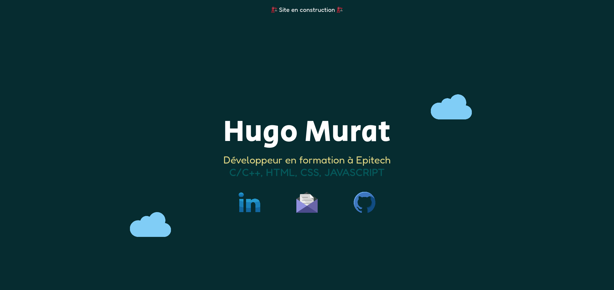

# <a href="http://hugo-murat.com/">my_website<a>

## This is my personal website !
#### This repository currently only contains a homepage with basic html/css.

## TO-DO LIST:
* make: the website responsive
* replace: "mailto" (mail.png) by my CV (homepage)
* edit: homepage add text uder logos ?
* add: navbar
* add: blog page
* add: skills page
    * programming languages
    * global tools (linux, vscode, office..)
    * cybersecurity tools (Nmap, Hashcat, SQLMap..)
    * tryhackme part
    * hack the box academy part
    * CTFS part
* add: projects page
    * personal projects
    * Epitech projects
* add: "about me" page
* add: "contact me" page